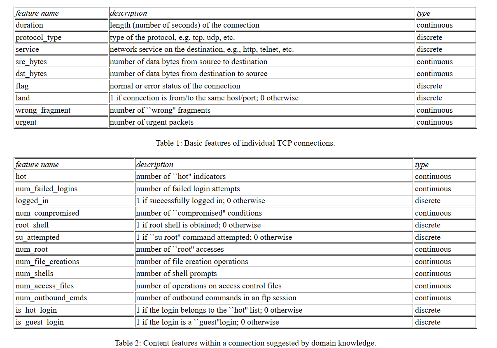
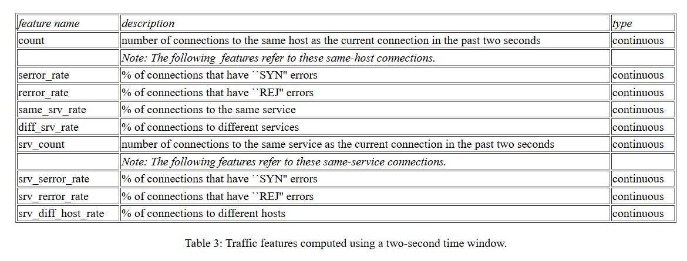
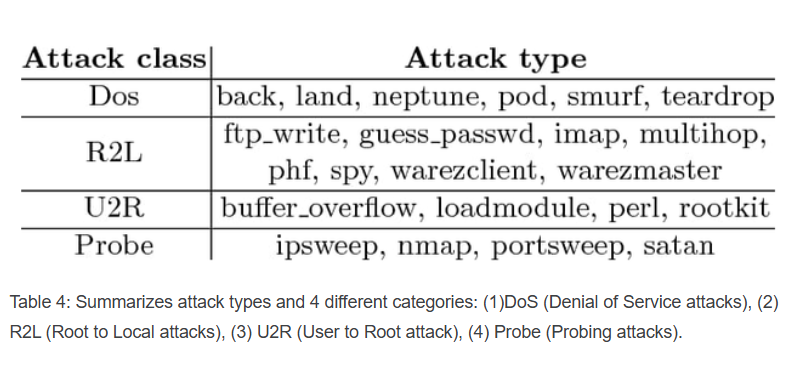

# DATASET: NSL-KDD

## Feature description


---


## Task and target variable

Attacks fall into four main categories:

- DOS: denial-of-service, e.g. syn flood

- R2L: unauthorized access from a remote machine, e.g. guessing password

- U2R:  unauthorized access to local superuser (root) privileges, e.g., various ``buffer overflow'' attacks

- Probing: surveillance and other probing, e.g., port scanning.

---

The datasets contain a total of 24 training attack types, with an additional 14 types in the test data only.

````Python
dos_attacks = ['apache2', 'back', 'land', 'neptune', 'mailbomb', 'pod', 'processtable', 'smurf', 'teardrop', 'udpstorm', 'worm']

r2l_attacks = ['ftp_write', 'guess_passwd', 'httptunnel', 'imap', 'multihop', 'named', 'phf', 'sendmail', 'snmpgetattack', 'snmpguess', 'spy', 'xlock', 'xsnoop', 'warezclient', 'warezmaster']

u2r_attacks = ['buffer_overflow', 'perl', 'ps', 'rootkit', 'sqlattack', 'xterm', 'loadmodule']

probe_attacks = ['ipsweep', 'mscan', 'nmap', 'saint', 'portsweep', 'satan']
````

Attacks in the training data:


---

It is a multi-class (5 classes) classification task with `attack_class` set as the target variable.
---

For further details on the dataset:

- [Kaggle Dataset Link](https://www.kaggle.com/datasets/hassan06/nslkdd)
- [Original Dataset Description](https://kdd.ics.uci.edu/databases/kddcup99/kddcup99.html)